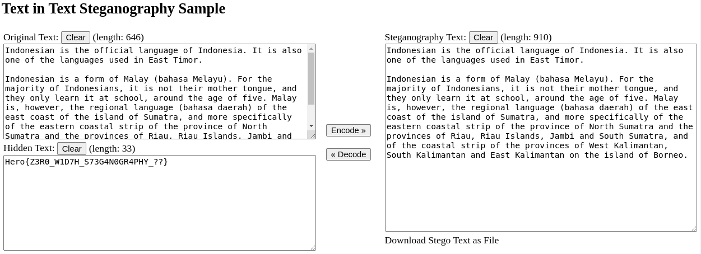

# Lebarnol

### Category 

Steganography

### Description

A message is hidden in this very interesting text about the Indonesian language. 

Good luck!<br><br> 

Format : **Hero{}**<br> 
Author : **Thibz**"

### Files

[flag.txt](flag.txt)

### Write up

With the contents of the text file, we can try to understand the title “lebarnol”. 

By testing a few things, we realize that “Lebar nol” in Indonesian means “Zero Width”, which is a steganography technique used to hide a message in text using the zero-width characters of Unicode.

Simply use an online converter to find the flag https://330k.github.io/misc_tools/unicode_steganography.html



### Flag

```"Hero{Z3R0_W1D7H_S73G4N0GR4PHY_??}"```