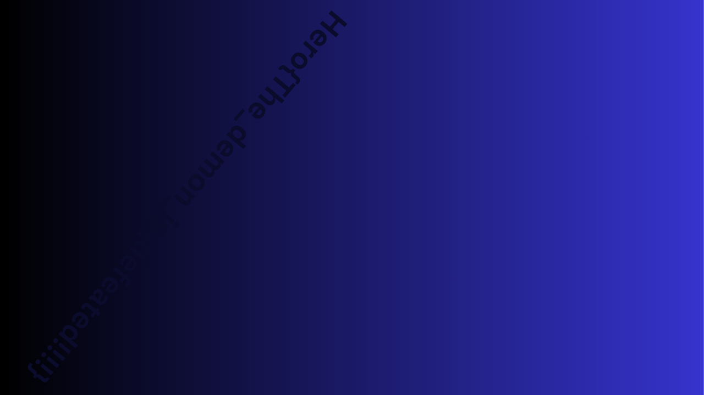

# Subliminal#2

### Category 

Steganography

### Description

The yellow demon triangle is back, even harder than before... An image has been hidden in this video. Don't fall into madness.

Little squares size : 20x20 pixels

Format : **Hero{}**<br>
Author : **Thibz**

### Files

[Triangle](subliminal_hide.avi)

### Write up

To really understand what is going on in this video, we have to watch it entirely. We can see quite quickly that squares of different colors appear. They actually form an image. Each frame of the video has a part of the image. So we need to divide the video into lots of frames and recover these 20x20px squares to reshape the image.

```python
def retrieve_image(video_path, output_path):
    video = cv2.VideoCapture(video_path)
    width = int(video.get(3))
    height = int(video.get(4))

    # Initialisation d'une image vide
    image = np.zeros((height, width, 3), np.uint8)

    i = 0
    while True:
        # Lire un frame de la vidéo
        ret, frame = video.read()
        if not ret:
            break

        # Récupérer les groupes de pixels dans le même ordre vertical
        x = (i // (height // 20)) * 20
        y = (i % (height // 20)) * 20
        image[y:y+20, x:x+20] = frame[y:y+20, x:x+20]
        i += 1
    
    cv2.imwrite(output_path, image)
    video.release()
```



### Flag

```Hero{The_demon_is_defeated!!!!}```